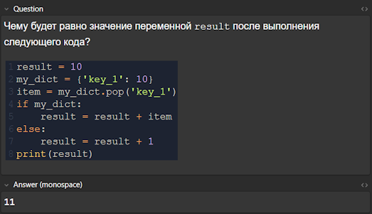
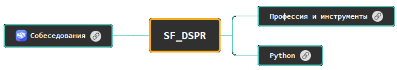

# 📚 DSPR Memory Files Repository

Привет! 👋 Это репозиторий, где я собираю материалы для запоминания по курсу **Профессия Data Scientist (DSPR)**. Здесь ты найдешь файлы для Anki и mindmap, которая поможет структурировать материал и сделать его более понятным. Подходит как для ревизии, так и для подготовки к аттестациям по курсу.

## Что здесь есть?

### 1. 📋 Anki-карточки
Файл содержит карточки для Anki, которые я создал на базе материалов курса. Они генерированы с помощью моделей ИИ на специальном инициализирующем [промте](./anki/chatgpt_promt.txt). Карточки делятся на:
- Вопросы с полем ввода (как на примере ниже).
- Обычные вопросы для легкого повторения материала.

Эти карточки помогут тренировать и закреплять знания, причем как в активной, так и в пассивной форме. Просто импортируй файл в Anki, и можно начинать! 🧠💪

### 2. 🧠 Mind Map
Карта, созданная в **EdrawMind**, содержит основные темы курса и дополнительный контент для лучшего понимания. Файл откроется в бесплатной версии программы, но, к сожалению, редактирование возможно только в платной. 

> **P.S.** Если нужен импорт карты в XMind, пиши! 👌  
> **P.S.S** Рекомендую использовать тёмную тему для программы, поскольку контент в примечаниях (и текст, и изображения) оптимизирован под нее. В будущем планирую пофиксить. ☀️🌙

Скачивай, учи, и пусть знания легко ложатся в память! 😎